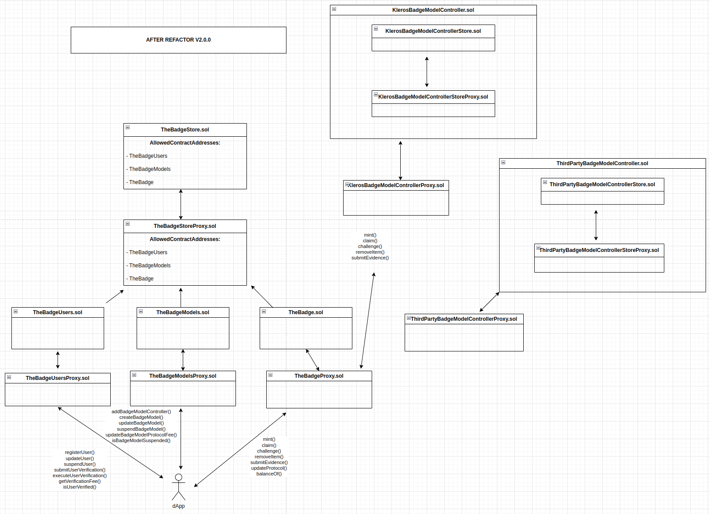

  

<h1 align="center">TheBadge DApp Smart-contracts</h1>

  
  

For questions or request information reach out via [Discord](https://discord.gg/tVP75NqVuC).

# TheBadge: a non-dynamic data oracle for web3 certifications.

## Introduction

TheBadge is a novel decentralized platform that leverages the ERC1155 token standard to represent unique badges. These badges, referred to as SBT (Soul-bonded tokens), hold distinct on-chain information for each user. Unlike traditional tokens, SBTs cannot be transferred or traded, as they embody exclusive user-specific data.

TheBadge's architecture is divided into two key components: "Badge Models" and "Badges." Badge Models are defined by badge creators and serve as templates for generating actual badges that end-users will possess. A Badge Model specifies not only the visual design of the badge but also governs how the information within it should be displayed and validated.

## Architecture Description

### Badge Models

Badge Models play an important role in TheBadge ecosystem. These models are created by the badge creators and set the standards for generating individual badges. Each Badge Model defines:

1. **Visual Design**: The appearance and layout of the badge.
2. **Information Presentation**: How the data contained within the badge should be displayed.
3. **Validation Process**: The criteria and methods for validating the information.

Presently, there are two distinct types of Badge Models within TheBadge:

#### 1. KlerosBadgeModel

These badges, also known as "Community badges," are issued based on a curated list maintained by Kleros. The KlerosBadgeModel can be challenged and potentially rejected by jurors participating in Kleros courts, following a challenge initiated by a TheBadge curator.

#### 2. ThirdPartyBadgeModel

These badges, also known as "Third-Party badges," are exclusively issued by previously registered and validated third-party companies that are part of TheBadge ecosystem. Each ThirdPartyBadgeModel operates as a [Kleros TCR](https://github.com/kleros/tcr) (Token-Curated Registry). Importantly, these lists are non-challengeable, and only the third-party company administrators have the authority to add or remove badges from the list, including the power to revoke credentials granted to their users.

### Badge Controllers

The core of TheBadge's smart contract architecture lies in the ability to incorporate additional "Badge controllers" in the future, to address diverse use cases. This flexibility allows for the expansion of TheBadge's capabilities, including support for various badge-related functionalities, such as zkBadges and third-party curation.

The central concept is that TheBadge is an ERC1155 contract that works as a reverse-proxy and which is dependent on controllers. Each controller is responsible for managing the logic associated with specific badge models. By introducing more controllers, TheBadge's versatility increases, providing endless possibilities for badge-related applications.

## Conclusion

TheBadge introduces an innovative decentralized non-dynamic data oracle ecosystem based on the ERC1155 token standard. This ecosystem is designed to support various badge models and controllers, offering a dynamic and versatile platform for unique on-chain badge representation. With Badge Models allowing to diverse use cases and the potential for expanding the ecosystem with new Badge controllers, TheBadge presents a promising future in the world of decentralized verifiable credentials.
