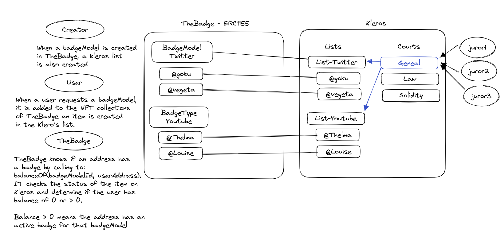

  

<h1 align="center">TheBadge DApp Smart-contracts</h1>

  
  

For questions or request information reach out via [Discord](https://discord.gg/tVP75NqVuC).

# TheBadge ERC1155-721 Badges architecture

## Introduction:

The Ethereum blockchain has two existing token standards for creating non-fungible tokens (NFTs) – ERC1155 and ERC721. While ERC721 is an older and more established standard, it can only create unique and indivisible tokens. In contrast, ERC1155 tokens can be both unique and interchangeable, making them suitable for creating multiple instances of the same asset with different properties. However, neither of these standards alone can cater to the use case of TheBadge, which requires a mix of both standards.

### Why is it not possible to follow only one standard?

TheBadge needs to track two types of information: BadgeModels and Badges. BadgeModels are templates that represent a validation strategy, such as owning a Twitter or YouTube handle. Badges are issued to users who provide evidence of following the criteria set by the BadgeModels. ERC1155 tokens can track BadgeModels, but they cannot distinguish among different badges for example with different due dates or a specific badge image for each asset, which cannot be achieved through ERC1155 alone.

### Our Solution: Mixing Standards

We propose a solution that combines the benefits of both ERC721 and ERC1155 standards. The BadgeModels will be represented with the token ID (unique auto-incremental) and well  each Badge will have its own unique auto-incremental ID. Although the minting process will be treated as ERC1155, the events triggered will be sent as if we were using an ERC721 standard, where each asset is unique. This modification will require us to make some conceptual changes to the ERC1155 standard.

### Conceptual Changes:

One ID per token: We will track each BadgeModels with its own auto-incremental ID.
One ID per badge: We will track each Badge with its own auto-incremental ID.
Event TransferSingle: We will use the badge ID instead of the BadgeModeld. Note that the mint method will receive BadgeModeld.
Event URI: We will use the badge ID instead of the BadgeModeld.

### Standard aggregation: Badge external ID On-Chain Verification

To distinguish between different badges of the same BadgeModel, TheBadge will issue each Badge with a unique Badge ID. We will use IPFS to store the Badge metadata off-chain, but it is not possible to link a Badge ID with a specific user handle on IPFS at a smart-contract level. To solve this problem, we will add a new public mapping that links each BadgeModel ID with a Badge External ID and an address. This mapping will track if a particular address has control over a specific user handle, as shown below:

“map(Twitter => @nico => 0x345)”;
“map(Twitter => @tina => 0x345)”

### Here is a diagram of our architecture:

